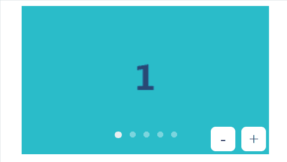
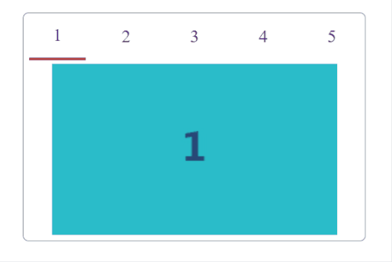

## Log

- product-price-filter.html [Check out the script here](https://udnwim.github.io/Javascript-Practice/)
  - Click on the price range, and it will filter the products for you.\
  

- member-adding.html
  - Enter the name, age, gender, location... and these information will show up in the table below.\
  

- _slideShow.html
  

- _switchingTab.html
  - Click on the numbers and it will switch to different pictures.\
  

- lottery2.html
  - Hit the begin button, a list of names will flash on the screen until you hit stop.\
  

- navBarEffect.html
  - a sliding effect when clicking on different tabs.\
  

- countdown.html (In progress)
  - A timer.
 

  
